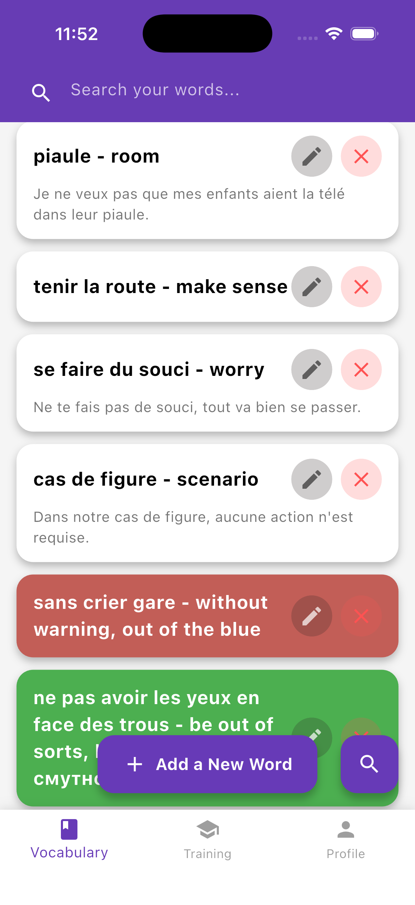
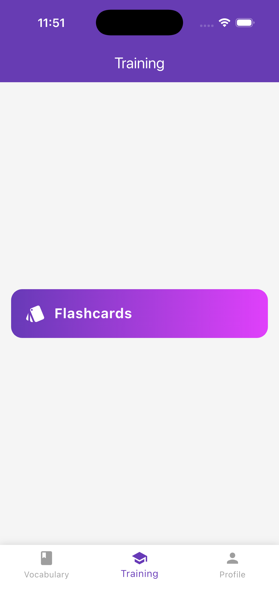
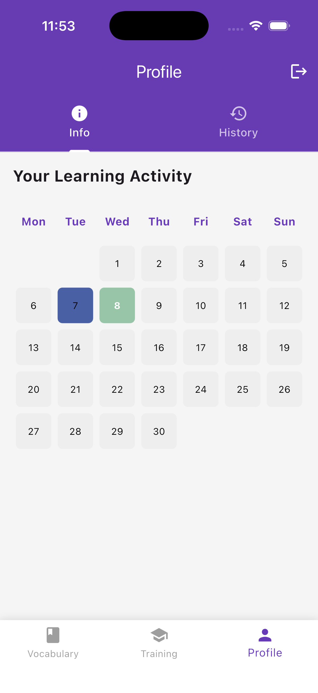

# 📚 Vocab App — Learn Smarter with Flutter

Welcome to **Vocab App** — a clean and minimal Flutter project that helps you learn, store, and practice vocabulary ✨  

It’s not just a demo — it’s a small real-world app with authentication, database, and scalable structure.

---

## 🚀 What’s inside?

This app demonstrates:

- Firebase Authentication (email + optional Google)
- Email verification flow 🔐
- Smart user routing
- Firestore database (per-user vocabulary)
- Material 3 UI 🎨
- Optional Cloud Functions ⚙️

---

## 📱 Features

### 🧠 Vocabulary Tab
- View your saved words  
- Add new words using ➕  
- Stored in memory / Firestore  

📸 Screenshot:  


---

### 🏋️ Training Tab
- Placeholder for future learning features  
- (quizzes, repetition, etc.)

📸 Screenshot:  


---

### 👤 Profile Tab
- User profile (coming soon)  
- Stats & settings planned  

📸 Screenshot:  


---

## 🧩 App Structure

BottomNavigationBar with 3 tabs:

- 📚 Vocabulary  
- 🏋️ Training  
- 👤 Profile  

---

## 🖼️ Screenshots

Place images in:

docs/images/

Example:

  
  


💡 Tip: Add `.gitkeep` so Git tracks the folder.

---

## ⚡ Quick Start

### 1. Install Flutter
https://flutter.dev/docs/get-started/install  

### 2. Run the app

```bash
flutter pub get
flutter run
```

For web:

```bash
flutter run -d chrome
```

---

## 🔥 Firebase Setup

1. Create a project:  
https://console.firebase.google.com  

2. Enable Authentication:
- Email/Password  
- Google (optional)  

3. Create Firestore database  

4. Add config files:
- Android → `android/app/google-services.json`  
- iOS → `ios/Runner/GoogleService-Info.plist`  
- Web → use `flutterfire` CLI  

---

## ✉️ Email Verification Flow

- User signs up → gets email 📩  
- App blocks access until verified 🔒  
- Auto-checks status  

---

## ☁️ Cloud Functions (Optional)

Example: delete unverified users after X minutes

```bash
firebase login
firebase use <your-project-id>

cd functions
npm install
cd ..

firebase deploy --only functions
```

---

## 🔐 Security Notes

Before production:

- Restrict Firestore access per user  
- Validate inputs  
- Protect user data  

---

## 🛠️ Troubleshooting

- Google Sign-In issues → check SHA keys  
- Email verification issues → restart app  
- Deploy errors → check firebase.json  

---

## 🤝 Contributing

- Open an issue  
- Submit a PR  
- Add tests if possible  

---

## 📄 License

No license yet ⚠️  
Consider adding MIT license  

---

## 💡 Future Ideas

- Spaced repetition 🧠  
- Flashcards  
- Progress tracking 📊  
- AI suggestions 🤖  

---

## ⭐ Final Thoughts

Good project to practice:

- Flutter architecture  
- Firebase integration  
- Real app structure  
